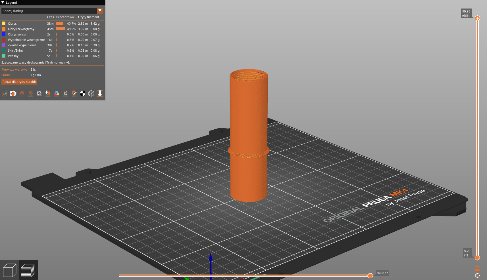
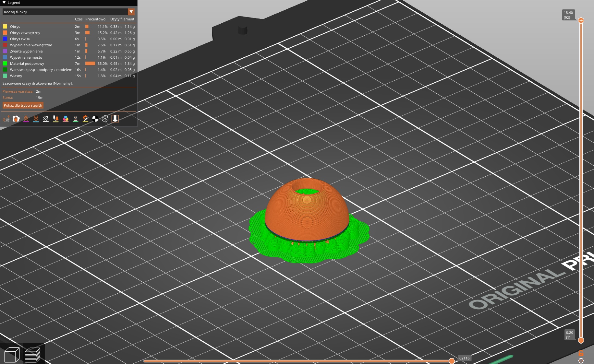
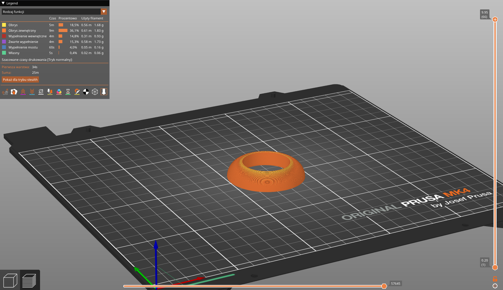
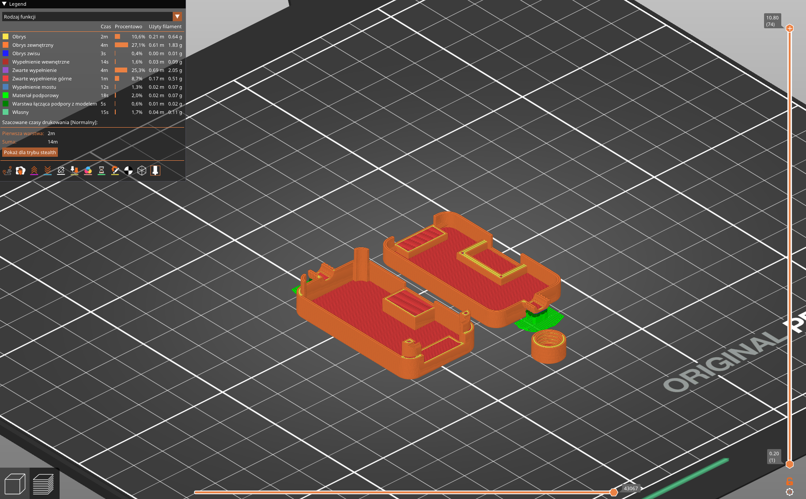

# 3d printed parts

**Use .step files as first choice**. All parts were printed with (Prusa MK4S printer and):

- standard black PLA
- 0.4mm nozzle
  - 0.15 layer height for shell in quality/structural mode (to print inner threads properly)
  - 0.2mm layer height for rest of parts (in speed mode)
- 15% infill (gyroid, but thats secondary)

Most of parts you should print in default orientation, unless stated otherwise. Below you can see extra settings for each part.

## Tower

Print it vertically. Supports are required, but avoid putting them in tight spaces inside (see picture below).

- [step](tower/tower.step)
- [3mf](tower/tower.3mf)
- [stl](tower/tower.stl)

Preview

### Where to avoid supports

You don't want to put supports between PCB holds and in the middle of the tower - only have them for flat overhangs outside and inside the tower.

## Shell

Quality/structural mode is **required** to print threads properly (like 0.15 layer height in structural mode), 5mm inner brim is **recommended** (you can scrape it off with deburring tool easily).

- [step](shell/shell.step)
- [3mf](shell/shell.3mf)
- [stl](shell/shell.stl)

Preview

## Hood

Print this part upside down, so you don't need supports.

- [step](hood/hood.step)
- [3mf](hood/hood.3mf)
- [stl](hood/hood.stl)

Preview

## cap

Top cap for the tower. Print it with supports.

- [step](cap/cap.3mf)
- [3mf](cap/cap.3mf)
- [stl](cap/cap.stl)

Preview

## Bottom Cap

- [step](bottom-cap/bottom-cap.step)
- [3mf](bottom-cap/bottom-cap.3mf)
- [stl](bottom-cap/bottom-cap.stl)

Preview

## Doughnut (aka holder)

Holder consist of three parts - "half" (of doughnut), "jam" and "half with hold" - you need to print all of them. No supports needed, just remember to print "half with hold" upside down.

> [!TIP]
> If you want to create your own holder - print "half" and "jam" - but create your own "half with hold" part. You can use "half.step" as a base and add your own design on top of it.

- Half
  - [step](doughnut/half.step)
  - [3mf](doughnut/half.3mf)
  - [stl](doughnut/half.stl)
- Jam
  - [step](doughnut/jam.step)
  - [3mf](doughnut/jam.3mf)
  - [stl](doughnut/jam.stl)
- Half with hold (print upside down)
  - [step](doughnut/half-with-hold.step)
  - [3mf](doughnut/half-with-hold.3mf)
  - [stl](doughnut/half-with-hold.stl)

"Half" preview

"Jam" preview

"Half with hold" preview

## Junction box

> [!NOTE]
> Step file for junction box consist of all three sub parts - top, bottom and nut.

Print junction box with supports - they are needed to support threads halves.

- Junction box
  - Full step file - [step](junction-box/junction-box.step)
  - Bottom
    - [3mf](junction-box/junction-box-bottom.3mf)
    - [stl](junction-box/junction-box-bottom.stl)
  - Top
    - [3mf](junction-box/junction-box-top.3mf)
    - [stl](junction-box/junction-box-top.stl)
  - Nut
    - [3mf](junction-box/junction-box-nut.3mf)
    - [stl](junction-box/junction-box-nut.stl)

Junction box holder is optional - but quite useful.

- Junction box holder
  - [step](junction-box/junction-box-holder.step)
  - [3mf](junction-box/junction-box-holder.3mf)
  - [stl](junction-box/junction-box-holder.stl)

