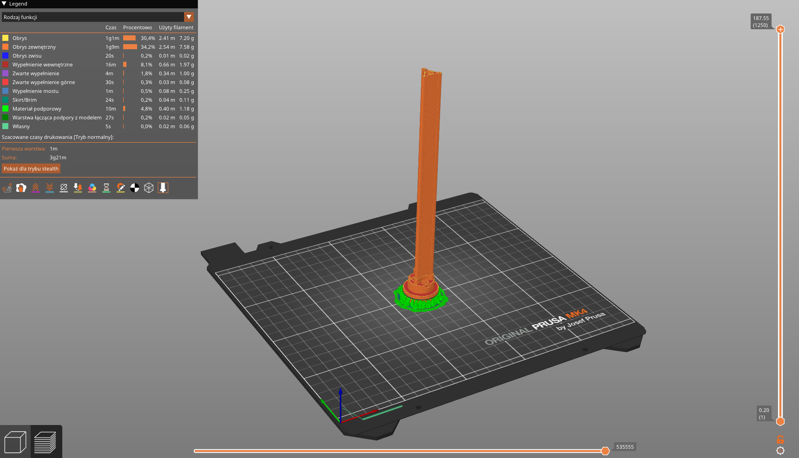
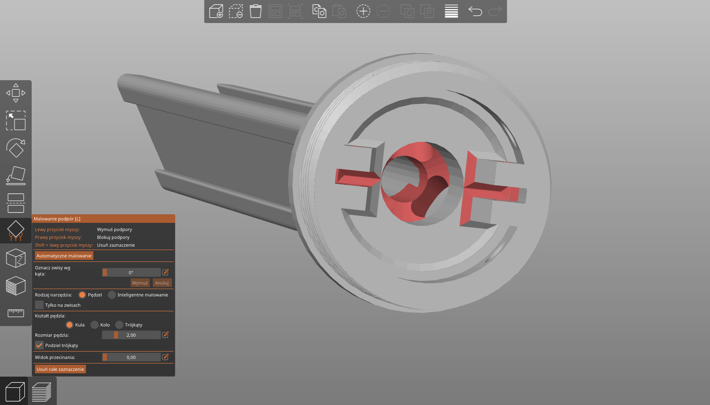

# 3d printed parts

All were printed with Prusa MK4 printer with 0.4mm nozzle and 0.15mm layer height with black PLA. Most of parts you should print in default orientation, unless stated otherwise.

Below you can see extra settings for each part. Sometimes there will be Prusa Slicer project file with all the settings and model ready to slice - it will be stated in the description.

## 01 Tower

Print it vertically with 5mm brim. Supports are required, but avoid putting them everywhere (see picture below) to make your life easier.

- [3mf](01-tower/tower.3mf)
- [stl](01-tower/tower.stl)
- [ready project](01-tower/tower.pdusa-slicer-project.3mf)

### Preview

### Where to avoid supports

You don't want to put supports between PCB holds and in the middle of the tower - only have them for flat overhangs outside and inside the tower.

## 02 Plug

Just print it on flat side. No supports or brim are needed.

- [3mf](02-plug/plug.3mf)
- [stl](02-plug/plug.stl)
