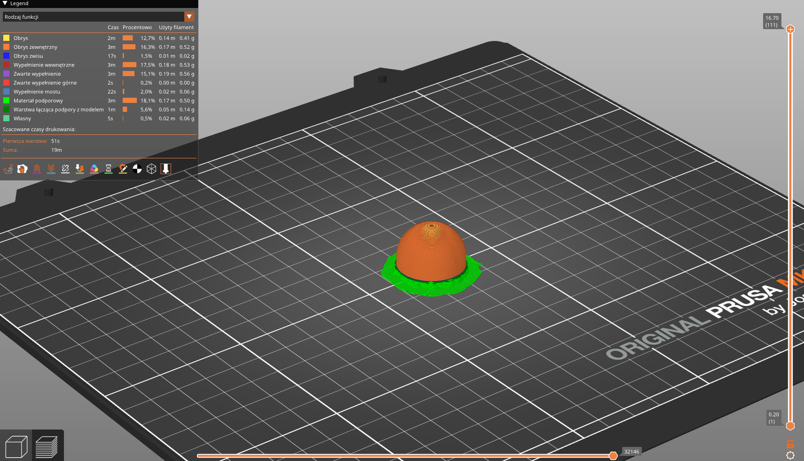

# 3d printed parts

All were printed with Prusa MK4 printer with 0.4mm nozzle and 0.15mm layer height, 15% infill and with black PLA. Most of parts you should print in default orientation, unless stated otherwise.

Below you can see extra settings for each part. Sometimes there will be Prusa Slicer project file with all the settings and model ready to slice - it will be stated in the description.

## 01 Tower

Print it vertically with 5mm brim. Supports are required, but avoid putting them everywhere (see picture below) to make your life easier.

- [3mf](01-tower/tower.3mf)
- [stl](01-tower/tower.stl)
- [ready project](01-tower/tower.prusa-slicer-project.3mf)

Preview

### Where to avoid supports

You don't want to put supports between PCB holds and in the middle of the tower - only have them for flat overhangs outside and inside the tower.

## 02 Plug

Just print it on flat side. No supports or brim are needed.

- [3mf](02-plug/plug.3mf)
- [stl](02-plug/plug.stl)

Preview

## 03 Hood

Print this part upside down, so you don't need supports.

- [3mf](03-hood/hood.3mf)
- [stl](03-hood/hood.stl)
- [ready project](03-hood/hood.prusa-slicer-project.3mf)

Preview

## 04 cap

Top cap for the tower. Print it with supports.

- [3mf](04-cap/cap.3mf)
- [stl](04-cap/cap.stl)
- [ready project](04-cap/cap.prusa-slicer-project.3mf)

Preview

## 05 Shell

5mm **inner** brim is recommended, you can scrape it off with deburring tool easily.

- [3mf](05-shell/shell.3mf)
- [stl](05-shell/shell.stl)
- [ready project](05-shell/shell.prusa-slicer-project.3mf)

Prewiew

## 06 Bottom Cap

- [3mf](06-bottom-cap/bottom-cap.3mf)
- [stl](06-bottom-cap/bottom-cap.stl)
- [ready project](06-bottom-cap/bottom-cap.prusa-slicer-project.3mf)

Preview

## 07 Doughnut (aka holder)

Holder consist of three parts - "half" (of doughnut), "jam" and "half with hold" - you need to print all of them. No supports needed, just remember to print "half with hold" upside down.

[!TIP]
If you want to create your own holder - print "half" and "jam" - but create your own "half with hold" part. You can use "half" as a base and add your own design on top of it.

- Half
  - [3mf](07-doughnut/half.3mf)
  - [stl](07-doughnut/half.stl)
- Jam
  - [3mf](07-doughnut/jam.3mf)
  - [stl](07-doughnut/jam.stl)
- Half with hold (print upside down)
  - [3mf](07-doughnut/half-with-hold.3mf)
  - [stl](07-doughnut/half-with-hold.stl)
  - [ready project](07-doughnut/half-with-hold.prusa-slicer-project.3mf)

"Half"" preview

"Jam" preview

"half with hold" preview

