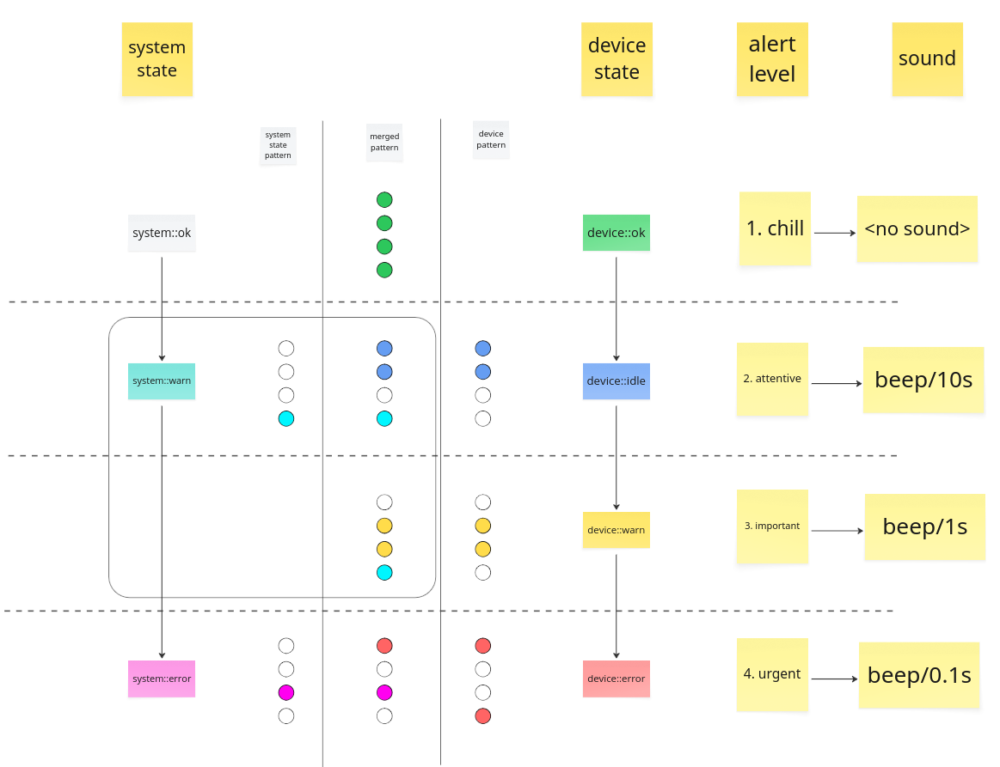

# ())))) Andon Light

Signal state with andon light!

## Docs

This document is not everything you need to know about this project, more info below in "More docs" section

> [!WARNING]
> This project is still in early development stage, so it may not work as expected.

## How does it work?

Andon light is a tool for monitoring external device and signaling its state using lights and sounds.

> [!NOTE]
> Currently only configuration for TCS3472 sensor and Prusa mk4 is available. More configurations will be (hopefully) added in the future.

There are two basic components:

- **Device** - something we want to monitor, like 3d printer; state of device is read by sensor
- **System** - andon light itself.

Both of them have their statuses and below you can see how those statuses are mapped to patterns, colors and sounds.



The algorithm works like this:

- Take the **highest** corresponding alert level from the **sensor and system state**
- Using patterns from that alert level, choose:
  - Pattern that matches both of the states
  - If no such pattern exists, choose the one that matches either of the states
- Choose sound that matches alert level

## Config

Store this in `andon.jso`. Currently there is no support for long file names (aka VFAT).

``` json
{
    "version": 0,
    "id": "my-3d-printer",
    "brightness": 10,
    "buzzer_enabled": true,

    "wifi_ssid": "your-ssid",
    "wifi_password": "your-password",

    "mqtt_host": "mqtt.example.com",
    "mqtt_port": 1883,
    "mqtt_username": "your-username",
    "mqtt_password": "your-password",
    "mqtt_device_type": "cnc",
    "mqtt_topic_prefix": "andon",
    "mqtt_topic": "your/custiom/topic"
}
```

### Config reference

- `id` - unique identifier of the device, it will default to `light-{MAC_ADDRESS}` if not set
- WiFi settings are optional, but required for MQTT
- MQTT section is optional, will work only with WiFi enabled
- `mqtt_username` - don't set for anonymous connection
- `mqtt_password` don't set for anonymous connection
- `mqtt_device_type` - `cnc` by default, used for mqtt topic construction, skipped if `mqtt_topic` is set
- `mqtt_topic_prefix` - `andon` by default, used for topic construction, skipped if `mqtt_topic` is set
- `mqtt_topic` - `null` by default, if not set - topic will be constructed using prefix, device type and id

## More docs

- To see the list of parts needed to build this project, check [this file](docs/parts.md).
- You will need few 3D printed parts, to print them follow [this guide](3d-models/readme.md).

## Development

List `devbin` dir to see available helpful commands
