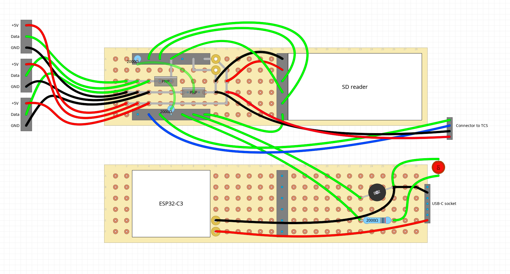

# Parts list

- ESP32C3 (from Seed Studio XIAO provided witn antenna)
- Prototype board - 2x8 cm
- 3x stripe of 16 smart leds (WS2812B) - with density of 96 leds per meter
- SD card module (WH125 spi sd reader module)
- SD card
- USB-C cables:
  - one with angle plug for programming - because of lack of space
  - second one with straight plug for power supply
- USB charger
- USB-C charging port
- 2x 2k Ohm resistors
- PNP transistor (S8550)
- buzzer with generator - THT 12mm
- red THT LED (for heartbeat, so preferrably RED)
- TCS3472 sensor
- four pin socket and connector
- Wire-To-Board Terminal Block (ARK connectors), 2.54 mm
  - 4 Ways - 2x
  - 3 Ways - 1x
- some 0.5mm^2 wire - it should be quite thin to make your life easier; you can harvest some from ethernet cable
- transparent plexiglass tube:
  - 20 mm outer diameter
  - 1 mm thickness
  - 18 mm inner diameter
  - 165 mm length
- toothpick

(To mount device first without soldering - also breadboard plus jumper wires are needed.)

## Wiring

- 5V <-> SD reader VCC, USB C port VCC, TSC3472 VIN, LED stripes anodes
- GND <-> SD reader GND, USB C port GND, TSC3472 GND, buzzer GND (-), red LED cathode, LED stripes cathodes (via transistor)
- 3V - not connected
- D10/GPIO10 (MOSI) <-> SD reader MOSI, LED stripes data in (via transistor)
- D9/GPIO9 (MISO) <-> SD reader MISO
- D8/GPIO8 (SCK) <-> SD reader SCK
- D6/GPIO21 - not connected
- D5/GPIO7 <-> TCS3472 SCL
- D4/GPIO6 <-> TCS3472 SDA
- D3/GPIO5 <-> "Ground transistor" base
- D2/GPIO4 <-> red LED anode
- D1/GPIO3 <-> buzzer anode (+)
- D0/GPIO2 <-> TCS3472 CS

